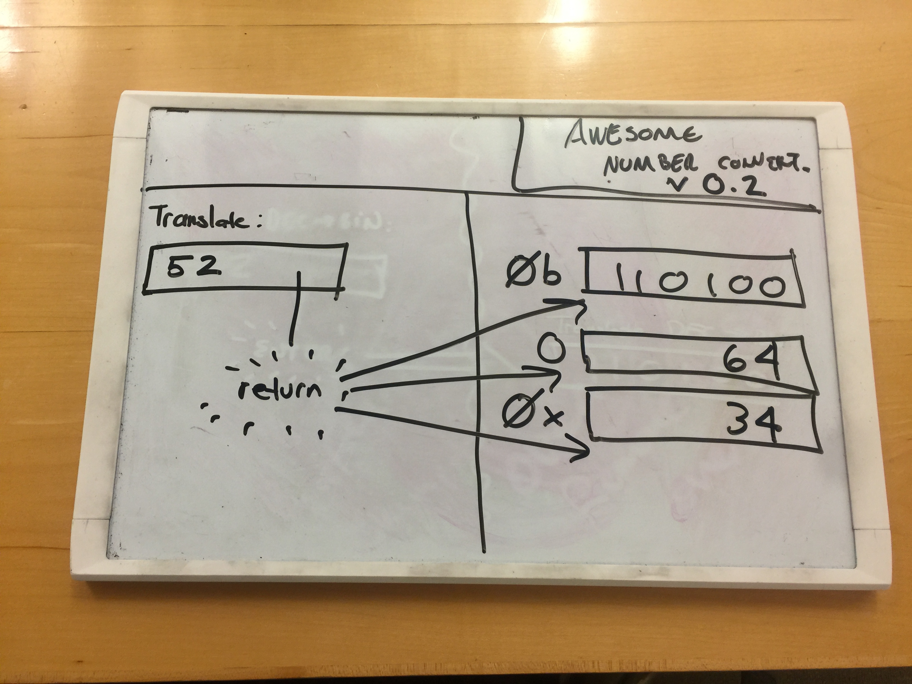

# Translator Widget with Shared State

## Learning Objectives

* Task 1: Name steps in mockup, static, widget design strategy
* Task 2: Identify atomic widget(s) from a mockup and create
* Task 3: Establish centralized, unidirectional data flow for communication between Widgets thus "composing" them

## Summary

_This is possibly the most important challenge of this module. Make sure you
understand the solution you implement here. If you understand this challenge,
React's virtues and design can be understood in mere minutes._

After finishing your hard work your CEO came back from an entrepreneur's
networking coffee and said that your translator was demoed and that there's
some constructive feedback on how to iterate forward. Here's another mockup:

Apparently the initial feedback was "changing the textbox value was kinda
unexpected," so item one is to make the translated display show up somewhere
else.

On the positive side, the reviewers really like this idea and would like to see
more translated number bases like BINARY (base 2), OCTAL (base 8), and
HEXADECIMAL (base 16). They further suggested that the result be displayed as
prefixed with the numeric literal prefixes for each of those bases `0b` for
binary, `0x` for hexadecimal, and `0` for octal.

## Releases

### Release 0: Build Your Environment

Build a new environment for this challenge. You should *not* port the code from
the previous implementation across. Doing so will bias you from seeing the
opportunities if you're too wedded to the old code.

### Release 1: Build a Static Version

Follow the process that was detailed today.

1. Mark off where Widgets likely exist
2. Create a static version of this site
  * Ensure CSS concerns are in a CSS file
  * Structural work is done in the HTML file
  * Your JavaScript file shouldn't be doing any real work (yet...)

### Release 2: Build Your Widgets With Static Data

Configure your page such that, on load, your JavaScript widgets are "owning"
rendering into the DOM. No interaction should be present. At the end of this
release you should have placeholder data in for all your widgets.

### Release 3: "Pull Up" the shared state

Implement a reasonably-named parent widget that holds the shared state. Make
sure it handles events that change state and make sure it advises child widgets
that they need to re-draw themselves when the state changes. Ensure that your
event-receiving widget hands off state change "upward" to the parent Widget.

## Stretch Releases

### Stretch 1: Refactor / Subclass

The various widgets that display the converted number have a great amount of
identical code. Could you extract some commonality to a parent class? Read the
Conclusion. Could you add error testing / argument flexibility so keep future
programmers honoring the right process into that parent class?

The more you practice "building JS frameworks" the more ready you are for *all*
possible JS frameworks!

### Stretch 2: Add Error Mitigation

Prevent uses from entering non-numbers like "PUMPKIN"

### Stretch 3: Update the Smallest Bit of DOM

Evaluate how much DOM you're replacing. Realize that for every element you
replace there's a performance cost. Can you update the code to update the
tiniest bit possible?

#### Conclusion

You'll notice that *how* to share state updates or how to propagate changes to
child views is _arbitrary_. There's no reason our process _has_ to store data
in something called `this.state`. There's no reason a register method has to be
created. The only thing that keeps this approach is discipline. We could add
more guidance and errors to keep the convention in place, but we're relying on
future programmers to honor the "contract." Over time it's likely those
disciplines will erode. However this suggests a virtue of React:

### REACT VIRTUE 4: DISCIPLINE AROUND SHARING STATE

Much of the "setting up the connections between widgets" is boring code to
write. With each additional connection between parents or even parents of
parents of parents the complexity grows and thus the chance for bugs.

React's custom template language, JSX allows us to not only write "smart"
templates, it allows us to specify state sharing and event bubbling in the
template! It's a powerful technology that does, in a template-y shorthand, what
we've been doing explicitly with JavaScript in these last two challenges.

